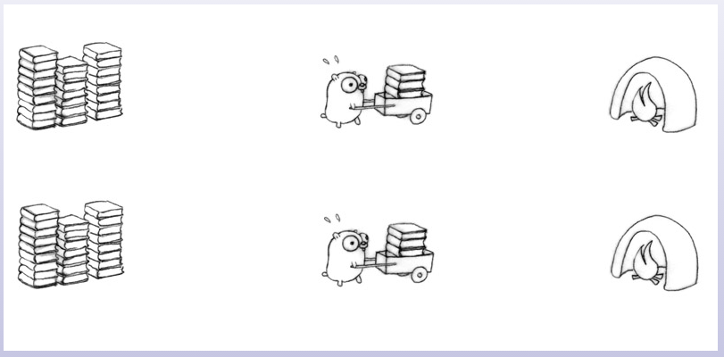
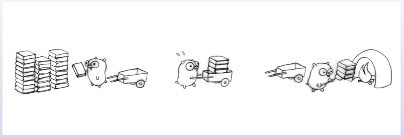
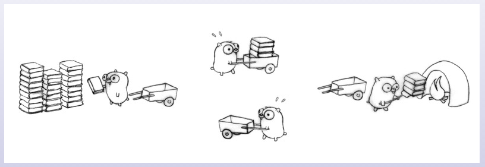
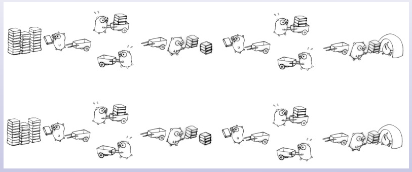

## 并发与并行

并发(Concurrently)和并行(Parallel)是两个不同的概念。借用Go创始人Rob Pike的说法，并发不是并行，并发更好。并发是一共要处理(deal with)很多事情，并行是一次可以做(do)多少事情。

举个简单的例子，华罗庚泡茶，必须有烧水、洗杯子、拿茶叶等步骤。现在我们想尽快做完这件事，也就是“一共要处理很多事情”，有很多方法可以实现并发，例如请多个人同时做，这就是并行。并行是实现并发的一种方式，但不是唯一的方式。我们一个人也可以实现并发，例如先烧水、然后不用等水烧开就去洗杯子，所以通过调整程序运行方式也可以实现并发。

## 大神讲解

如果还不理解，建议看Rob Pike题为Concurrency is not Parallelism的[演讲PPT](http://concur.rspace.googlecode.com/hg/talk/concur.html)和[演讲视频](http://blog.golang.org/concurrency-is-not-parallelism)。

我把演讲的PPT截图贴出来方便大家理解。

## 总结

总结一下，并行是实现并发的一种方式，在多核CPU的时代，并行是我们设计高效程序所要考虑的，那么进程是不是越多越好呢？
